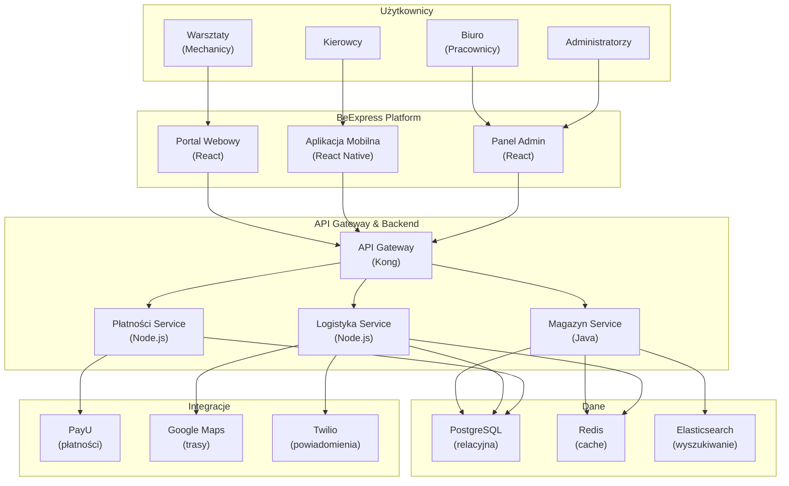
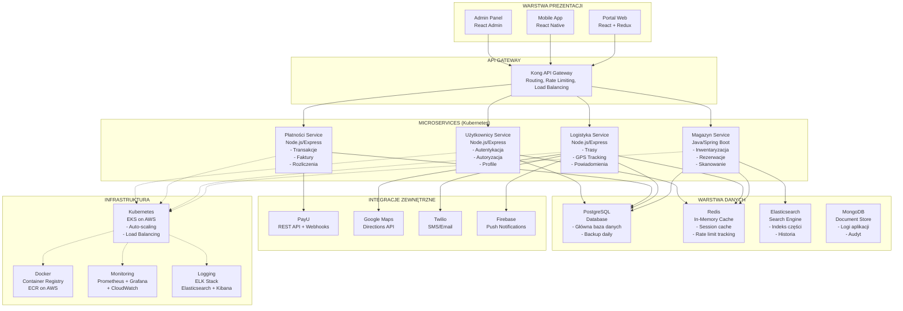
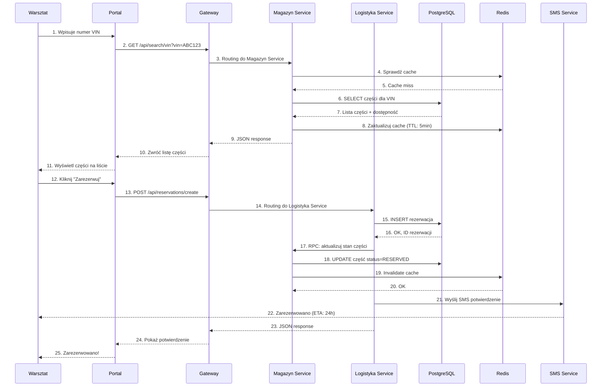
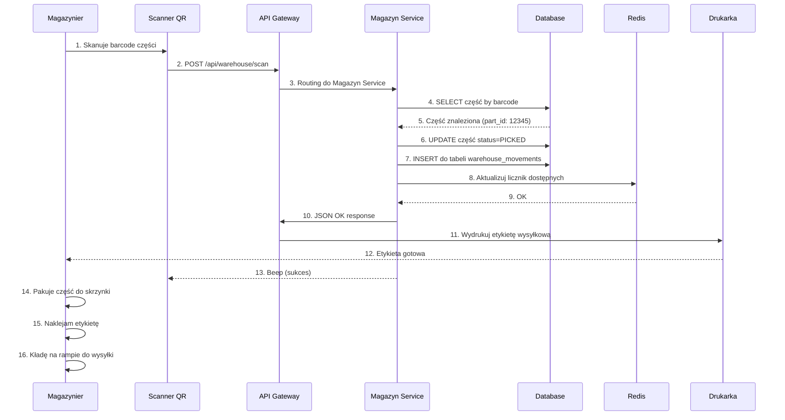
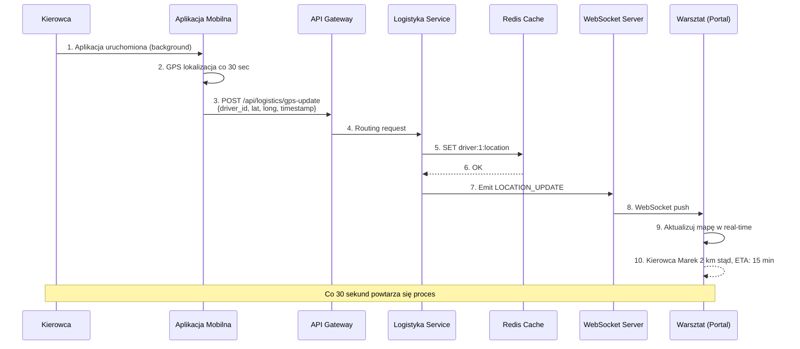
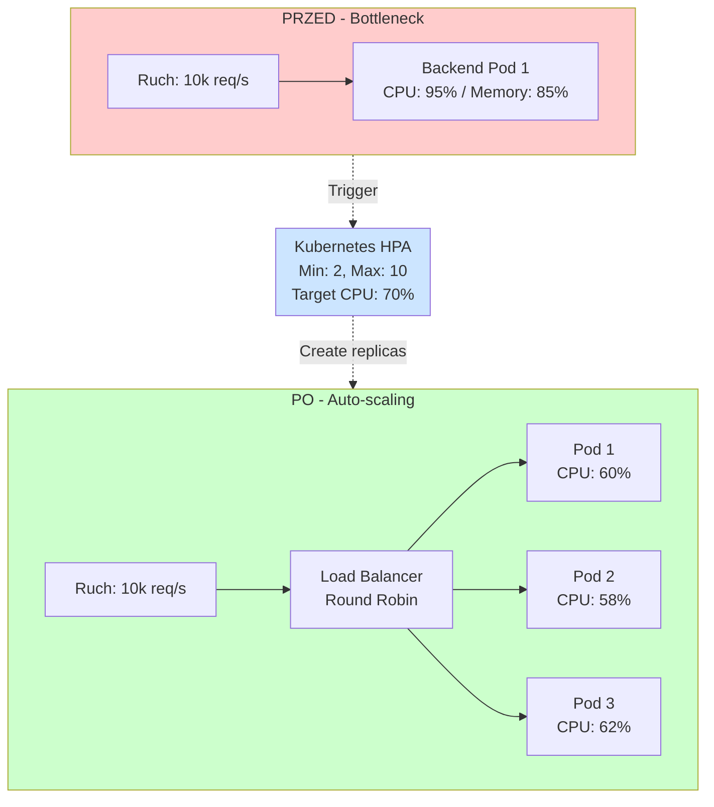
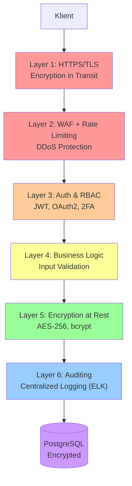
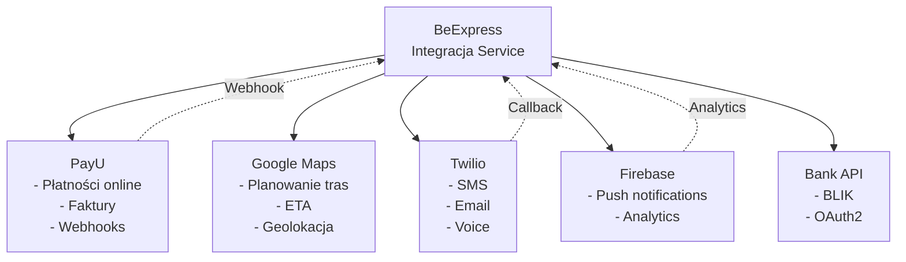
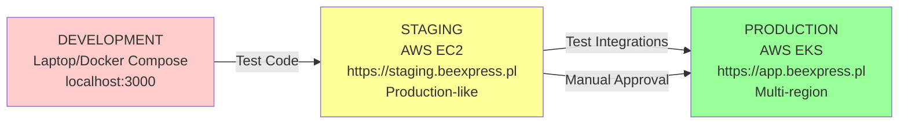

# Diagramy Architektury - Format Mermaid

## Diagram 1: Architektura C4 Level 1 (Wysokopoziomowa)

---

## Diagram 2: Architektura Techniczna (Level 2)

---

## Diagram 3: Przepływ Danych - Rezerwacja Części

---

## Diagram 4: Przepływ Danych - Skanowanie w Magazynie

---

## Diagram 5: GPS Tracking Dostawy (Real-time)

---

## Diagram 6: CI/CD Pipeline

```mermaid
graph LR
    A["Developer<br/>commit"] --> B["GitHub<br/>Repository"]
    B --> C["GitHub Actions<br/>Pipeline"]
    
    C --> D["Run Tests<br/>Jest, Mocha"]
    D -->|Pass| E["Code Quality<br/>SonarQube"]
    D -->|Fail| Z["Block Merge"]
    
    E --> F["Security Scan<br/>Snyk, OWASP"]
    F --> G["Build Docker Images"]
    
    G --> H["Push to ECR<br/>AWS Container Registry"]
    
    H --> I["Deploy to Staging<br/>Kubernetes"]
    I --> J["Integration Tests"]
    J -->|Fail| Z
    
    J -->|Pass| K["Manual Approval<br/>Code Review"]
    K -->|Approved| L["Deploy to Production"]
    K -->|Rejected| Z
    
    L --> M["Health Checks<br/>+ Monitoring"]
    M --> N["Prometheus +<br/>Grafana"]
    
    style Z fill:#ff6b6b
    style N fill:#51cf66
    style M fill:#51cf66
```

---

## Diagram 7: Skalowanie Poziome (Auto-scaling)

---

## Diagram 8: Warstwy Bezpieczeństwa

---

## Diagram 9: Integracje Zewnętrzne

---

## Diagram 10: Architektura Wdrażania (Environments)

---
